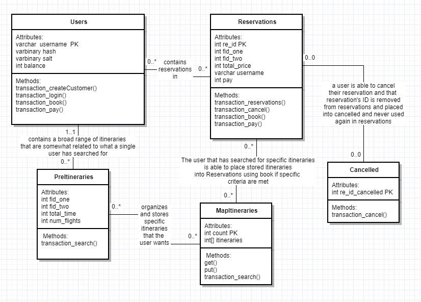

I created a table for Users because I believed that Users could not be 
saved internally. Multiple terminals had to know whether what a user id was already taken, and the balance of the user could change depending on whether another terminal cancelled or paid for a reservation. A Reservations table was also made for the same reason: Multiple terminals could have bookings that interfere with one another (for example: two terminals wanting to book a flight with 1 capacity) so it would be impractical to save this information internally. A table filled with Cancelled reservations had to be made in order to keep track of whether a Reservation had been made and cancelled, which was necessary information to know because if a Reservation had been made and/or cancelled, the Reservation primary key (which is of identity type) had to be reseeded to 0, or else the seed would not properly start at 1. PreItinerary was a table, which it did not necessarily need to be; however, it being a table allowed for me to use specific SQL queries that made it easier to organize itineraries to store into MapItineraries, which was a HashMap saved internally. I made sure to run and clear all queries involving PreItinerary as a single transaction in order to ensure that the information stored into PreItinerary would basically be only stored internally. These decisions I took made sure that all search information was stored internally and could not be accessed externally. This is important because it ensures that when multiple users search for different itineraries and book the same Itinerary ID, they do not accidentally book the same itinerary. 

